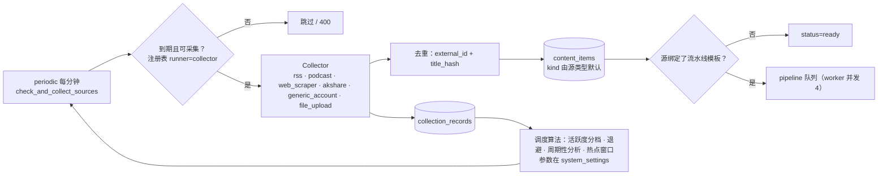
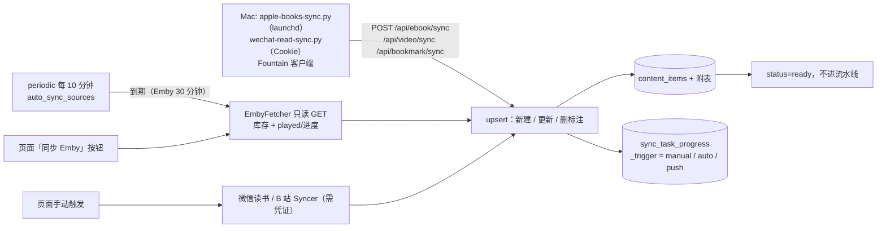
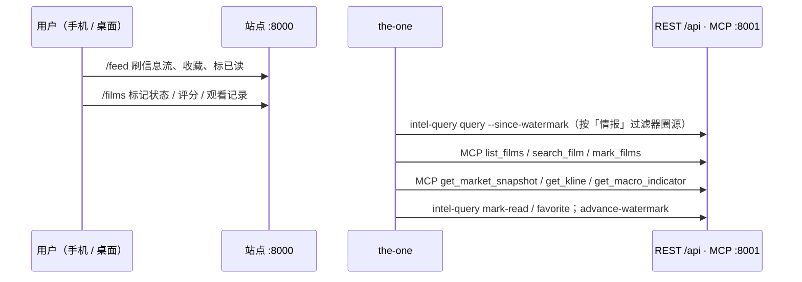

# 40 流程

> 回答：数据怎么进来、怎么处理、怎么被读；人怎么部署、备份、授权、迁移。
> 核实日期：2026-09-23

## 1. 系统链路

### 1.1 采集（信息流）



12 个高流量源（Reuters、委员会、AI 大佬、v2ex、晚点、YouTube×3、B 站×2 等）的 URL 指向 `http://rsshub:1200/...`，`source_type` 仍是 `rss.standard`。

### 1.2 流水线

模板步骤按序执行，每步可读前序输出：`extract_content`（feed 原文）→ `enrich_content`（全文抓取 L1 → L2 → L3）→ `translate_content` → `localize_media`（图片下载；视频 / 音频只在收藏后下载）→ `transcribe_content` → `analyze_content`（LLM，当前无 Key，不产出）→ `publish_content`。8 个内置模板：仅分析、仅推送、媒体下载、文章分析、英文文章翻译分析、视频下载分析、视频翻译分析、金融数据分析。

### 1.3 同步与推送（资料库）



影视：Emby `played=true` 且状态为空时自动填一次"看过"；手动标记永不被同步覆盖；`upsert_films` 无变化不写库；海报在入库时拉取落盘。

### 1.4 保留与清理

`cleanup_scheduler` 每小时检查，到 `system_settings.cleanup_content_time` 执行 `cleanup_expired_content`：只对采集型数据源（`SourceCategory.NETWORK`），删过期且不受保护的内容（收藏、有笔记、有收藏媒体的受保护）及其媒体文件；`cleanup_records` 清运行记录；`cleanup_job_queue` 每日 03:20 CST 清 7 天前作业、回收僵死作业。资料库领域不进清理。

### 1.5 读取面



已读、滚动、批量标记写 `view_count` / `last_viewed_at`；只有详情接口写 `opened_at`。the-one 的增量游标是自己的水位线文件，不用 `view_count`。

## 2. 操作流程

### 2.1 部署

```bash
./deploy-home-server.sh          # rsync → /opt/allin-one → docker build → 用新镜像跑 alembic → up -d → 健康检查
./deploy-home-server.sh status
```

迁移先于容器切换，因此迁移必须对旧代码向后兼容（加表 / 加列 / 加索引），破坏性变更拆两次发布。回滚：部署前 `docker tag allin-one:home-server allin-one:backup-<date>`，retag 后 `up -d`。生产直改未回流曾造成漂移，部署前 `diff -rq` 两边 backend。

### 2.2 备份与恢复

```bash
scripts/backup-home-server.sh backup      # pg_dump -Fc + data/ + .env + compose → restic 快照，forget/prune
scripts/backup-home-server.sh snapshots
scripts/backup-home-server.sh check
scripts/backup-home-server.sh restore-db latest /tmp/restore     # 取出 dump，不动生产库
docker exec -i allin-postgres pg_restore -U allinone -d allinone --clean --if-exists < /tmp/restore/var/backups/allin-one/allinone.dump
```

仓库 `/mnt/sda2/backup/restic-allin-one`，密码 `/opt/allin-one/.restic-password`（0600，需另存）。timer `allin-one-backup.timer` 已装、停用；启用即每日 03:30。全新数据库须先启动 Postgres、`alembic upgrade head`，再起应用与 worker，避免应用启动期 `create_all` 先建表。

### 2.3 同步源授权

| 源 | 现状 | 操作 |
|---|---|---|
| Emby | 已授权，自动同步 | 凭证为 authentication.db `Tokens_2` Id 10 的服务器级 key，`base_url` 必须 `http://192.168.1.103:8096`；只调 GET，绝不调 `DELETE /Items/{id}` |
| 微信读书 | 停用，待授权 | 浏览器登录 weread.qq.com 取 Cookie，跑 `scripts/wechat-read-sync.py --cookie` 或在同步管理页录入凭证 |
| Apple Books | 源启用，脚本依赖 Mac | Mac 上 `scripts/apple-books-sync.py`，launchd plist `com.allinone.apple-books-sync.plist` |
| Bilibili | 停用，待扫码 | 扫码后 Cookie 同步到 RSSHub 与 `platform_credentials` |
| TMDb | 已配置 `system_settings.tmdb_api_key` | 无 key 时手工添加只建骨架、补全禁用 |

### 2.4 数据迁移（待执行）

- 图书馆：Mac 上的 `allinone_20260228_042448.sql` 开隔离临时库，取 `content_items(kind=book)`、`media_items`、`book_annotations`，再重跑 Apple Books / 微信读书同步。
- the-one `archive/`（1,192 篇）、`journal/` 2015–2025（约 1,150 篇 Apple Notes 日记）、`_assets/`：待导入接口就绪后走导入；核对通过前 the-one 不删文件。

### 2.5 在生产库上验证改动

`pg_dump` 快照 → 临时 postgres 容器（等日志第二次 "ready to accept connections"）→ 用 `allin-one:home-server` 镜像挂载工作区跑 alembic / uvicorn / 脚本；镜像里没有 curl，从宿主机按容器 IP 访问。
