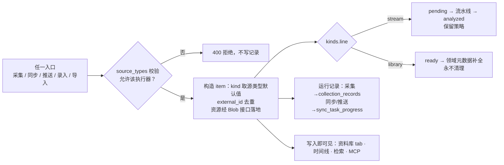
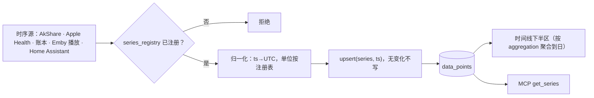
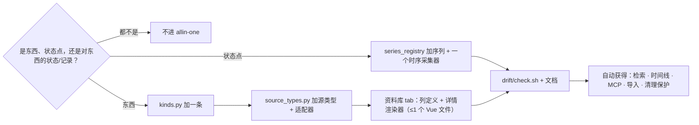
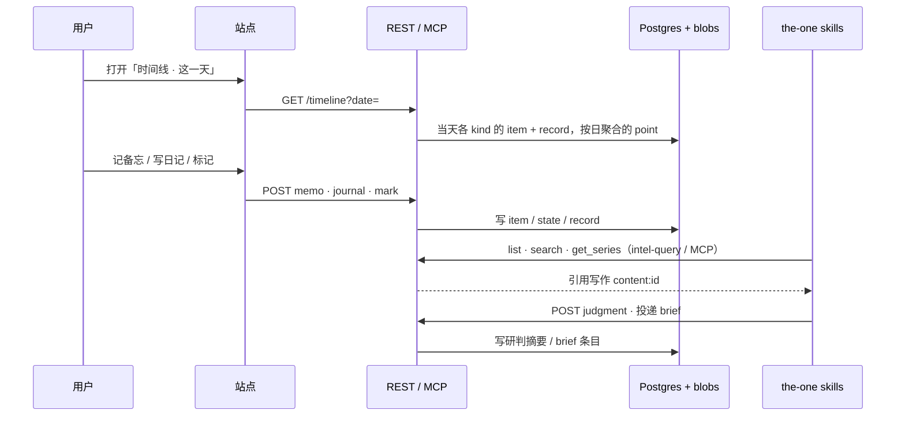

# 技术方案: 个人内容系统的数据模型与存储模型

> 版本: v1.0 | 日期: 2026-09-23 | 状态: 方案定稿，待实施（实施顺序见 §9；待定项见 §10）

---

## 1. 背景与目标

allin-one 要从"信息聚合平台"扩成**全面的个人内容管理系统**：图书馆、影视、文库、日记、备忘、书签、媒体文件、AI 会话，以及身体 / 财务 / 时空 / 环境等状态数据。用户 2026-09-23 定下的建设原则：

- **先构建完整视图，用法边建边探索。** 使用证据是事后观察，不是准入门槛。领域按广度优先加入，不用"先证明有消费者"来卡建设。
- **可独立离线运行的个人数据服务。** 落地的资源都是自有副本，不存在"缓存、丢了可以从上游重拉"这一类；浏览路径零外网。
- **模型清晰，备份友好。** 概念少到说得清，真相少到备得全。

本文档定义的是模型与存储，不是页面；页面与领域功能各自另写 `design_<领域>.md`。它是 `docs/audit_2026-09_architecture.md` 定下的"两条主线 + `content_items.kind`"约束的延伸，不推翻它。

### 与 the-one 的分界

**allin-one 存记录，the-one 存判断。** 一条东西如果是"同类对象中的一行"，价值在于完整、可查、可同步、带状态（一本书、一部片、一篇收藏的文章、某天的日记、一条备忘），归 allin-one；如果价值在于论证和上下文、会随理解变化被反复改写（画像、话题分析、研判手册、预测、复盘），归 the-one。判据："它会被重写吗"，记录只追加不重写，判断持续重写。

the-one 引用 allin-one 对象写 `content:<id>`，不复制正文；allin-one 只存 the-one 投递的研判摘要与 brief。两边零共享存储（one 契约，`one/docs/02-对象模型与契约.md`）。

---

## 2. 概念模型

五个概念，一个从属关系：

```
source   来源      东西从哪来
item     东西      一条离散内容，kind 决定领域
  asset  资源      东西的文件，从属于东西，不独立存在
state    状态      人对东西的当前态度，每东西至多一行，可改
record   记录      发生在东西上的事，每东西多行，只追加
point    点        发生在序列上的值；序列没有"东西"，只有时间轴
```

两条判据决定一个对象是什么：

| | 主语是东西 | 主语是序列 |
|---|---|---|
| **当前态**（一行，可改） | state | （序列的当前值 = 最新的 point） |
| **发生过**（多行，追加） | record | point |

任何新对象先过这两条。既不是东西、也不是状态 / 记录、也不是点的，不进 allin-one（例如凭证、判断、画像）。

为什么 asset 不与 item 并列：资源是东西的文件载体，文章的插图、书的封面和 epub、播客的音频、上传件的本体。日记、备忘、书签没有资源，因为它们的正文是文本，内联在东西里。规则：**文本内联，文件外置。**

为什么 state 与 record 分开：影视的"看过 / 想看"是状态，"某天看了一遍、打了几分"是记录；图书的"读到 40%"是状态，"划了一条线"是记录。合并会让一行既要可改又要追加。

---

## 3. 存储模型

### 3.1 真相只在两处

| 真相单元 | 装什么 | 性质 |
|---|---|---|
| **Postgres** | 全部结构化数据、全部正文、全部小资源（`bytea`） | 可变，事务一致，一份 `pg_dump -Fc` 即整体 |
| **`data/blobs/<sha256>`** | 大于阈值的资源：视频、音频、电子书、PDF | 不可变，内容寻址，只增不改 |

除这两处外，任何数据都是**派生品**，必须能从真相重建，并有重建命令：检索向量、导出的 markdown、缩略图、统计缓存。派生品不进备份范围。

### 3.2 为什么小资源进 Postgres

小文件存储的本质是"打包加索引"（SQLite blob、SeaweedFS、Haystack 都是这个思路）。Postgres `bytea` 就是打包加索引，并且与元数据同一事务、同一份备份、一次级联删除，不引入新进程。SQLite 的读取优势是相对散文件的，不是相对 Postgres 的；把小资源放进 SQLite 会变成第二个数据库、第二个备份单元。

技术事实：超过约 2KB 的值走 TOAST 分块外存；图片本身已压缩，`assets.data` 列设 `STORAGE EXTERNAL` 跳过压缩；单值上限 1GB；`pg_dump` 用 `-Fc`（纯文本格式会把 bytea 十六进制转义、体积翻倍）。适用边界：小资源几万个、几十 GB 以内。现状两千个、约 70MB（海报 1197 张 64MB + 文章插图 7.4MB）。

### 3.3 Blob 接口

业务代码只认 key，不知道资源在哪：

```
put(bytes, mime) -> key
get(key)         -> bytes
delete(key)
```

| 后端 | 装什么 | 状态 |
|---|---|---|
| Postgres `bytea` | 小于阈值：图片、封面、海报、小附件 | 默认 |
| `data/blobs/` | 大于阈值：视频、音频、电子书、PDF | 默认 |
| S3 兼容（MinIO 等） | 照片等把文件数推到十万级的领域 | 预留，不实现 |

### 3.4 大文件的规则

- 以内容 sha256 命名，不可变，只增不改。
- 行在文件不在 → 校验任务检出并标记；文件在行不在 → 回收任务清理。
- 删东西时按引用计数回收（同一文件可被多个东西引用）。

---

## 4. 表

业务表六张。流水线、运行记录、凭证、设置、任务队列是运维表，不属于模型，不随领域增长。

```
source_configs   来源：不变
content_items    东西：id kind title url author published_at external_id
                       raw_data(原始采集，真相) body(正文，真相)
                       analysis_result(LLM 输出，按真相对待)
                       status is_favorited favorited_at is_lead lead_at judgment
                       user_note collected_at title_hash duplicate_of_id ...
assets           资源：id content_id role filename mime size sha256
                       data(bytea) 或 path —— 二者必居其一
item_states      状态：content_id(PK) status progress rating marked_at extra(jsonb)
item_records     记录：id content_id type at precision text note location external_id meta(jsonb)
data_points      点：  id series source_id ts value meta(jsonb)
```

| 表 | 来自 | 变化 |
|---|---|---|
| `content_items` | 现有 | `processed_content` 改名 `body`；加 `is_lead` / `lead_at` / `judgment`（one 契约） |
| `assets` | `media_items` | 去掉 `playback_position` / `last_played_at` / `is_favorited`（搬到 `item_states`）；加 `sha256` / `data`；`role` 取值 `cover` / `poster` / `inline` / `file`；海报从 `data/posters/` 收编进来 |
| `item_states` | `watch_records` + `reading_progress` | 合并；`status` 词表按 kind 登记在 `kinds.py` |
| `item_records` | `watch_logs` + `book_annotations` + `book_bookmarks` | 合并；`type` 取值 `watched` / `highlight` / `note` / `bookmark` / `played`；`book_bookmarks` 是阅读器拆除后的残留，数据为空，随合并删除 |
| `data_points` | `finance_data_points` | 泛化：`category` / `date_key` 等收进 `series` 与 `meta`；OHLC 进 `meta` |
| `series_registry` | 新 | 代码注册，不建表：`series` / `unit` / `domain` / `aggregation` |
| `kinds` 注册表 | 新 | 代码注册，不建表：见 §5 |

`media_items` 现状：348 行，其中仅 61 行有本地文件；其余 287 行只是正文里已有的远程链接又抄了一遍。收编成 `assets` 时只保留有本体的行，远程链接留在正文。

---

## 5. 两张注册表

关于"从哪来"的知识只在 `backend/app/models/source_types.py`（既有约束）。关于"是什么"的知识只在 `backend/app/models/kinds.py`（新增）。任何地方不得自维护 kind 名单，不得从 `source_type` / `media_type` / `raw_data` 反推领域。

每个 kind 登记：

| 字段 | 含义 |
|---|---|
| `label` | 显示名 |
| `line` | `stream`（进流水线、过保留期）或 `library`（不进流水线、永不清理） |
| `state_vocab` | `item_states.status` 的合法取值，如 film: `unmarked backlog want watching watched dropped` |
| `record_types` | 该领域允许的 `item_records.type` |
| `search_fields` | 进全文检索的字段 |
| `timeline` | "这一天"视图的渲染方式 |
| `in_feed` | 是否进信息流口径（替代现在的 `FEED_HIDDEN_KINDS`） |

检索、时间线、导入、MCP 工具、清理保护全部从这两张注册表生成。领域只提供适配器与详情渲染器。

---

## 6. 领域 × 概念

| 领域 | kind | line | 进来的方式 | state | record | 资源 |
|---|---|---|---|---|---|---|
| 文章 / 播客 | `article` `audio` | stream | 采集 | 播放进度、收藏 | `played` | 插图、音频 |
| 影视 | `film` | library | Emby 同步、手工、豆瓣 | 观看状态、评分 | `watched` | 海报 |
| 图书馆 | `book` | library | 微信读书、Apple Books、Kindle 推送 | 进度、读完 | `highlight` `note` | 封面、epub |
| 文库 | `doc`（新） | library | 导入、收藏晋升、网页剪藏 | 收藏 | — | 插图 |
| 日记 | `journal`（新） | library | 站点录入、Apple Notes 导入 | — | — | 图片 |
| 备忘 | `note` | library | 站点录入、IM 同步 | `is_lead` 晋升线索 | — | — |
| 书签 | `bookmark` | library | Safari、Chrome、GitHub Star 推送 | — | — | — |
| 媒体与文件 | `file` | library | 上传、视频下载 | 播放进度 | `played` | 本体 |
| AI 会话 | `session`（新） | library | capture 管线推送摘要 | — | — | — |
| 音乐播放、身体、财务、时空、环境 | `data_points` | — | 时序采集器 | — | — | — |
| 照片 | `photo`（远期） | library | 独立系统，只接索引 | — | — | S3 后端 |

日记以 `published_at` 为日期键，一天可多条，不建附表。AI 会话只存摘要与主题，不存全文。

### 两条主线在这个模型里只剩策略

| | stream | library |
|---|---|---|
| 流水线 | 进 | 不进，`ready` 直接可用，领域元数据补全各自处理 |
| 清理 | 按保留期，收藏 / 有笔记 / 线索受保护 | 永不自动清理；源有内容时拒绝非级联删除 |
| 存储 | 同一套 | 同一套 |

收藏晋升文库 = 改一行 `kind`（`article` → `doc`），并保证全文、图片、正文改写三件事落地，缺一件即晋升失败进重试队列，而不是置位了事。

---

## 7. 备份友好在模型上的五条约束

1. **真相单元不超过两个，且第二个不可变。** 一份 dump 加一个只增目录，任何时刻的两份合起来就是完整状态。
2. **每个字段标明真相还是派生。** `raw_data`、`body`、`assets.data`、状态、记录、点是真相；`analysis_result` 理论可重跑但花钱且不可复现，按真相对待；检索向量、导出、缩略图、统计缓存是派生。
3. **跨单元引用只用内容哈希。** `assets.path` 指向的文件以 sha256 命名，两个方向的不一致都可检出。
4. **id 稳定，不含语义。** 改标题、换来源、重新识别都不改 id；the-one 的 `content:id` 引用永不失效。
5. **删除是级联的。** 删东西即删它的资源、状态、记录；大文件按引用计数回收。

Markdown 可读性靠导出满足，不靠存储介质：library 领域的条目在写入时同步导出 `data/export/<kind>/<yyyy>/<id>.md` 加资源，是派生品，可全量重建。它让 agent 离线可读、灾难恢复不依赖代码，且不违反 KERNEL 的"长期事实沉淀为 markdown"。

---

## 8. 流程

### 8.1 条目入库



### 8.2 状态点入库



### 8.3 加一个领域（固定配方）



禁止：领域单独的检索接口、单独的导入格式、单独的流水线、单独的附表（状态与记录已统一）。

### 8.4 读取面与 the-one 回路



---

## 9. 实施顺序

1. **模型层**：`kinds.py`；`assets`（含海报收编与 `STORAGE EXTERNAL`）；`item_states` / `item_records` 合表迁移（影视 1177 条状态 + 观看记录，图书当前为空）；`data_points` 泛化；Blob 接口两个后端。迁移对旧代码向后兼容（加表 / 加列先发，删旧表后发）。
2. **共享层**：统一导入接口 `POST /api/library/import`（markdown + frontmatter，按标题哈希幂等）；全文检索；时间线接口；MCP 按 kind 生成 list / search / mark / get_series；`mark_films` 收敛为 `mark(kind=film)`。
3. **灌数据**：图书馆从 Mac 上的 2026-02-28 快照捞 `content_items(book)` / `media_items` / `book_annotations`，微信读书重新授权，Apple Books 脚本重跑；the-one `archive/`（1192 篇）导入 `doc`；the-one `journal/` 2015–2025（约 1150 篇 Apple Notes）导入 `journal`；`_assets` 与 finance 截图上传。核对通过前 the-one 不删文件。
4. **页面**：资料库单页（领域为 tab）、时间线、文库、日记、备忘录入、书签；`/media` 页删除，载体只在条目详情以附件出现；顶栏固定五项：信息流、资料库、时间线、数据源、设置。
5. **同步源**：IM 备忘、Kindle、豆瓣、Emby 播放记录、Apple Health 导出。

与本方案并行、不依赖任何模型决定的一件事：本机目前没有任何 `pg_dump` / restic 任务，库与 `data/` 均无备份。加每日任务，dump（`-Fc`）与 `data/` 进同一个 restic 快照。

---

## 10. 待定项

需要用户拍板：

- **资源进库阈值**：倾向 5MB，覆盖全部图片与封面，电子书多数落盘。
- **`raw_data` 是否永久保留原始 HTML**：它是采集真相，保留最稳；代价是 stream 条目体积约翻倍（现状 38MB）。
- **状态词表放哪**：倾向 `kinds.py`，表只存字符串，换领域不改表。
- **与既有定案的三处冲突**：① one 项目 2026-09-14 定案"不做页面编辑、不做知识界面"，本方案收窄为"不做判断类对象的页面"，记录类对象允许 CRUD；② console 应以 subtree 进 `one/console/`、`allin-one` 冻结，实际未做且影视库持续在 allin-one 开发，建议 subtree 合并作为独立一步、不阻塞本方案；③ 2026-09-20 定的"电子书域先不动"需解除。

## 11. 明确不做

- 不为领域单独建表、单独写检索、单独写导入格式。
- 不把载体当领域展示（现 `/media` 页的视频 / 音频 / 图片三 tab）。
- 不区分"缓存"与"自有副本"：落地的都是自有副本，都进备份单元。
- 不实现 `product_spec.md` §2.9"收藏 2.0"（林迪分数、AI 对质、间隔重现）：2026-03 的设想，六个月无使用拉动。
- 不在 allin-one 存判断（画像、话题分析、研判手册、预测、复盘）。
