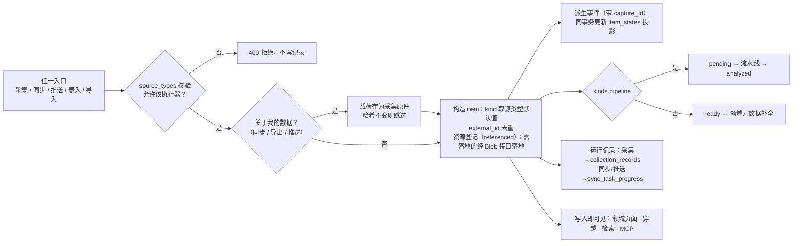
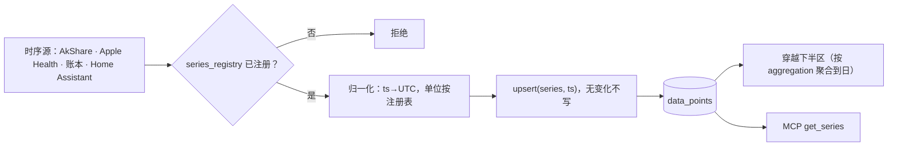
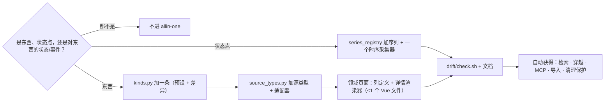
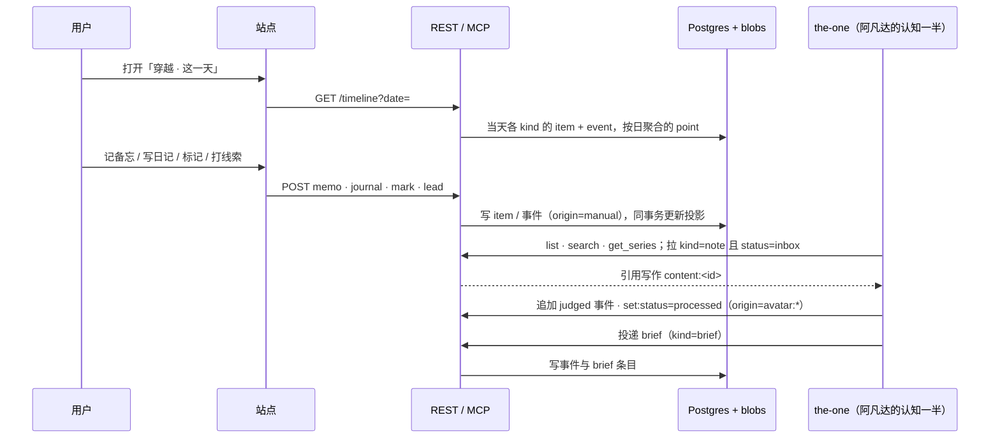

# 技术方案: 个人内容系统的数据模型与存储模型

> 版本: v1.3 | 日期: 2026-09-29 | 状态: v1.0（2026-09-23）经数字阿凡达 / 数据主权复核修订，决策见 the-one `_spec/决策记录.md` D12–D35；待实施（实施顺序见 §9）

---

## 1. 背景与目标

allin-one 扩成全面的个人内容管理系统：图书馆、影视、文库、日记、备忘、书签、媒体文件、AI 会话，以及身体 / 财务 / 时空 / 环境等状态数据。本文档只定义**数据模型与存储模型**，是 `docs/audit_2026-09_architecture.md` 定下的"两条主线 + `content_items.kind`"约束的延伸；页面与领域功能各自另写 `design_<领域>.md`。

**定位**：阿凡达（个人在数字世界的化身）= allin-one + the-one。allin-one 是感知与记录的一半，the-one 是认知与判断的一半；the-one 不是外部调用方（D12）。

**三条前提**（决策与理由见 the-one `_spec/决策记录.md`）：**先构建完整视图、用法边建边探索**；**可独立离线运行**，落地资源皆为自有副本、无"缓存可重拉"一类；**allin-one 存记录，the-one 存判断**，the-one 引用只写 `<类型>:<id>`，两边零共享存储。

**检验标准：数据主权三原则**（D18）：关于我的数据，我拥有的不少于平台；平台对它的运用能力不超过我；处理服务可以随时替换，原始数据始终保留。任何模型决定先过这三条。

---

## 2. 概念模型

五个概念，一个从属关系：

```
source   来源      东西从哪来
item     东西      一条离散内容，kind 决定领域
  asset  资源      东西的文件，从属于东西；有来源，落地与否是状态
state    状态      我对东西的当前表态与最新观测，每东西至多一行
event    事件      发生在东西上的事，每东西多行；唯一真相
point    点        发生在序列上的值；序列没有"东西"，只有时间轴
```

外加一个支撑概念：**capture 采集原件**——同步、导出、推送进来的关于我的数据，其原始载荷原样保存；由它派生出的条目与事件可重新解析得到（D18）。

两条判据决定一个对象是什么：

| | 主语是东西 | 主语是序列 |
|---|---|---|
| **当前态**（一行） | state（事件的投影） | （序列的当前值 = 最新的 point） |
| **发生过**（多行，追加） | event | point |

任何新对象先过这两条。既不是东西、也不是状态 / 事件、也不是点的，不进 allin-one（例如凭证、判断、画像）。**消费东西的行为一律记为事件；`data_points` 只放没有主语的序列**（心率、体重、价格、位置）（D19）。

**kind 表示"它在我生活中是什么"，不表示载体**（D33）：创作者的一次发布（文章、播客单集、在线视频）都是 `post`，介绍在 `body`，媒体是资源，主媒体 `role=enclosure`；展示方式由资源决定（有音频主媒体显示音频播放器，依此类推），不由 kind 决定。

**状态分两类**（D14、D34）：

| 类 | 字段 | 规则 |
|---|---|---|
| **表态** | `status`、`rating`、`favorited_at`、`lead_at`、`note`、`tags` | 事件的投影：每次表态追加一条事件，同一事务更新 `item_states`；可从事件全量重建 |
| **观测** | `progress`、`extra.position` | 最新观测值，直接记录；有意义的节点另记 `finished` 事件 |

**事件只追加**（D34）：修改 = 追加 `amend`（指向原事件，`meta` 带新值），撤销 = 追加 `retract`；投影取更正后的值，编辑历史一并保留。

**`origin`：证据来源**，不是行为人（行为人始终是我或我的分身）（D17、D18）：

| origin | 含义 |
|---|---|
| `manual` | 本人亲手（站点上点击、录入） |
| `avatar:<skill>` | the-one（阿凡达的认知一半），如 `avatar:digest` |
| `sync:<源>` | 外部系统报告的事实，如 `sync:emby`、`sync:douban` |

**文本内联，文件外置**：资源是东西的文件载体（文章插图、书的封面与 epub、发布的主媒体、上传件本体）。日记、备忘、书签没有资源，正文内联在东西里。

**引用与 id**：id 全局唯一、不含语义；引用统一为 `<类型>:<id>`（`content:`、`source:`；`entity:` 为保留前缀，实体表推迟）（D13）。

---

## 3. 存储模型

### 3.1 真相只在两处

| 真相单元 | 装什么 | 性质 |
|---|---|---|
| **Postgres** | 全部结构化数据、全部正文、全部小资源（`bytea`） | 可变，事务一致，一份 `pg_dump -Fc` 即整体 |
| **`data/blobs/<sha256>`** | 大于阈值的资源（视频、音频、电子书、PDF）；采集原件载荷 | 不可变，内容寻址，只增不改 |

**逐类定性**：

| 类 | 定性 |
|---|---|
| 手动与分身的事件（`origin` 为 `manual` / `avatar:*`） | 真相：本身即原始记录 |
| 采集原件（`captures` + blob） | 真相 |
| 同步事件（`origin=sync:*`）、有原件的源在条目 `raw_data` 中的源块 | 原件的派生，可重新解析 |
| 无原件的采集条目的 `raw_data`、`body`；已落地的资源本体 | 真相 |
| 观测字段（`item_states.progress`、`extra.position`） | 真相：最新观测值 |
| 表态字段（`item_states` 其余字段） | 事件的投影 |
| `analysis_result` | 派生品，须记产出者 `{model, model_version, prompt_version, produced_at}`，多个产出者的结果并存、不互相覆盖；可以不重跑，但不是真相（D24） |
| 检索向量、导出的 markdown、缩略图、统计缓存 | 派生品 |

派生品须能从真相重建并有重建命令，不进备份范围（`analysis_result` 与原件派生物存在库里，随 dump 备份，但不作真相）。

**资源的落地状态**（D34）：资源 = 东西的一个文件，有来源（`source_url`，上传件为空）；落没落地是状态：`referenced`（只有来源）→ `landed`（本体落地后才有 `sha256` + `data` / `path`）。所有资源都收编。离线保证由策略字段决定：`retention=forever` 的 kind，资源必须全部 `landed`；`retention=period` 的 kind 允许 `referenced`。晋升即把全部资源落地。

### 3.2 为什么小资源进 Postgres

小文件存储的本质是"打包加索引"（SQLite blob、SeaweedFS、Haystack 都是这个思路）。Postgres `bytea` 就是打包加索引，并且与元数据同一事务、同一份备份、一次级联删除，不引入新进程。SQLite 的读取优势是相对散文件的，不是相对 Postgres 的；把小资源放进 SQLite 会变成第二个数据库、第二个备份单元。

技术事实：超过约 2KB 的值走 TOAST 分块外存；图片本身已压缩，`assets.data` 列设 `STORAGE EXTERNAL` 跳过压缩；单值上限 1GB；`pg_dump` 用 `-Fc`（纯文本格式会把 bytea 十六进制转义、体积翻倍）。适用边界：小资源几万个、几十 GB 以内。现状两千个、约 70MB（海报 1197 张 64MB + 文章插图 7.4MB）。

### 3.3 Blob 接口

业务代码只认 key，不知道资源在哪：

```
put(bytes, mime) -> key
get(key)         -> bytes
delete(key)
```

| 后端 | 装什么 | 状态 |
|---|---|---|
| Postgres `bytea` | 小于阈值（5MB，D26）：图片、封面、海报、小附件 | 默认 |
| `data/blobs/` | 大于阈值：视频、音频、电子书、PDF；采集原件不看阈值，一律在此 | 默认 |
| S3 兼容（MinIO 等） | 照片等把文件数推到十万级的领域 | 预留，不实现 |

### 3.4 大文件的规则

- 以内容 sha256 命名，不可变，只增不改。
- 行在文件不在 → 校验任务检出并标记；文件在行不在 → 回收任务清理。
- 删除与压缩时按引用计数回收（同一文件可被多个东西引用）。

### 3.5 采集原件

- **范围**：只覆盖**关于我的数据**（同步、导出、推送）。RSS 等公共内容不进，条目 `raw_data` 已足够（D19）。
- 每批原始载荷（API 响应、Takeout 压缩包）按内容哈希存入 blobs；**载荷不变不新建**。
- 由原件派生的条目与事件带原件引用（`capture_id`）。
- 最小实现：只存载荷与引用；重新解析工具等真要重解析时再写（D20）。
- 公共内容条目的 `raw_data` 保留原始 HTML，直到条目按保留期被清理（§6 清理保护，D26）。

---

## 4. 表

首批业务表八张（`item_identifiers` 推迟，见 §4.3）。流水线、运行记录、凭证、设置、任务队列是运维表，不属于模型，不随领域增长。

```
source_configs   来源：不变
content_items    东西：id kind title url author published_at collected_at external_id
                       raw_data body analysis_result pipeline_status
                       title_hash capture_id ...
assets           资源：id content_id role source_url filename mime size meta
                       sha256 + data(bytea) 或 path —— 落地后二者居其一，referenced 时皆空
item_states      状态：content_id(PK)
                       表态（投影）：status rating favorited_at lead_at note tags marked_at
                       观测：progress extra.position
                       extra
item_events      事件：id content_id type at precision text note location external_id
                       origin capture_id meta(jsonb) created_at
item_links       关系：from_id to_id rel origin created_at meta
captures         原件：id source_id captured_at sha256 mime size
data_points      点：  id series source_id ts value meta(jsonb)
```

| 表 | 来自 | 变化 |
|---|---|---|
| `content_items` | 现有 | 只管"它是什么"：`processed_content` 改名 `body`，`status` 改名 `pipeline_status`；移出 `is_favorited` / `favorited_at` / `is_lead` / `lead_at` / `user_note`（→ 状态）、`judgment`（→ `judged` 事件）、`opened_at` / `view_count` / `last_viewed_at`（→ 事件与状态）、`duplicate_of_id`（→ `item_links`）；删除 `chat_history`；加 `capture_id` |
| `assets` | `media_items` | 去掉 `playback_position` / `last_played_at` / `is_favorited`；加 `source_url` / `sha256` / `data` / `meta`；状态 `referenced` / `landed`；`role` 取值 `cover` / `poster` / `inline` / `enclosure` / `file`；海报从 `data/posters/` 收编进来 |
| `item_states` | `watch_records` + `reading_progress` + `content_items` 上的态度列 | 合并；表态字段由事件投影，观测字段为最新观测值 |
| `item_events` | `watch_logs` + `book_annotations` + `book_bookmarks` + 研判 | 合并；`book_bookmarks` 是阅读器拆除后的残留，数据为空，随合并删除 |
| `item_links` | 新 | 首批 `rel` 只有 `derived_from`、`duplicate_of` |
| `captures` | 新 | 载荷在 blobs |
| `data_points` | `finance_data_points` | 泛化：`category` / `date_key` 等收进 `series` 与 `meta`；OHLC 进 `meta` |
| `series_registry` | 新 | 代码注册，不建表：`series` / `unit` / `domain` / `aggregation` |
| `kinds` 注册表 | 新 | 代码注册，不建表：见 §5 |

`media_items` 全部收编成 `assets`（D34）：有本地文件的为 `landed`，只有远程链接的为 `referenced`（含播客与视频的主媒体，`role=enclosure`）。

### 4.1 事件与投影

- **表态事件**统一为 `set:<字段>`，新值在 `meta.value`，`null` 表示清除：`set:status` / `set:rating` / `set:favorite` / `set:lead` / `set:note` / `set:tags`。投影逻辑通用，加表态字段不加代码。
- **发生的事**（与表态并存）：`watched`、`played`、`highlight`、`note`、`judged`、`opened`、`finished`。
- **更正**：`amend`（指向原事件，`meta` 带新值）、`retract`（撤销原事件）。
- **投影优先级**：每字段取最新的 `manual` 或 `avatar:*` 事件；两者皆无才取最新的 `sync:*`（"同步不覆盖手动"对所有表态字段统一生效）。
- 收藏可来自 `manual`、`avatar:*` 或 `sync:<平台>`（平台上的收藏也是我的表态），投影优先级同上；**只有手动收藏触发晋升**。线索只能由 `manual` / `avatar:*` 设置（D22）。`item_states.rating` 只投影手动评分；外部评分、单次观看评分只在事件里。
- **只追加**：任何人都不覆盖、不删除事件；修改与撤销以 `amend` / `retract` 表达，投影取更正后的值。同步事件以 `(content_id, origin, external_id)` 幂等写入：同键不重复追加，同一外部记录再次同步到的新值以 `amend` 追加。

### 4.2 从现有表到目标的映射

| 现有 | 目标 |
|---|---|
| `watch_records.status` | `set:status` |
| `watch_records.status_source` | 事件 `origin`：`manual` → `manual`，`emby_autofill` → `sync:emby`，`douban_import` → `sync:douban` |
| `watch_records.tags` | `set:tags`，投影为 `item_states.tags` 数组 |
| `watch_records.my_rating` / `watched_at` / `watched_precision` | 删除（最近一次观看的缓存），读时取最新 `watched` 事件。影视无整体评分，`item_states.rating` 为空 |
| `watch_logs` | `watched` 事件：`at` / `precision` / `note`，评分进 `meta.rating`，`origin=manual` |
| `reading_progress.progress` | 观测字段 `item_states.progress` |
| `reading_progress.cfi` / `section_index` / `section_title` | 观测字段 `extra.position` |
| `book_annotations` | `highlight` / `note` 事件：`selected_text` → `text`，`note` / `location` / `external_id` 同名；`color` / `cfi_range` / `section_index` 进 `meta` |
| `media_items.original_url` / `metadata_json` | `assets.source_url` / `assets.meta` |
| `media_items` 有本地文件 / 只有远程链接 | `landed` / `referenced` |
| `media_items.playback_position` / `last_played_at` | 所属东西的观测字段 |
| `media_items.is_favorited`：68 张图片 | 提升为独立 `file` 条目 + `derived_from` 指回原文 |
| `media_items.is_favorited`：3 个音频（所属文章的主媒体） | 资源不带表态：给所属 `post` 追加 `set:favorite` 并晋升为 `doc`，音频随之落地（D35） |
| `content_items.is_favorited` / `favorited_at` | `set:favorite` |
| `content_items.kind`：`article`（11,146）/ `audio`（178） | `post`（D33） |
| `content_items.last_viewed_at` | `post` 的 `set:status=read` |
| `content_items.opened_at` | `opened` 事件；`view_count` 删除（由 `opened` 计数） |
| `content_items.duplicate_of_id` | `item_links(duplicate_of)` |
| `content_items.user_note` / `chat_history` | 删除（实测为空） |

迁移时每个有值的表态字段生成一条初始事件：时间取原行 `updated_at`（收藏取 `favorited_at`），`meta.migrated=true`。

### 4.3 推迟（双向门，按触发条件再建）

| 项 | 触发条件 | 此前 |
|---|---|---|
| `item_identifiers(item_id, scheme, value)`，`(scheme, value)` 唯一；合并掉的 id 存为 `scheme=merged` | 同一东西第二次从别的源进来（接豆瓣、Kindle） | 沿用 `content_items.external_id` |
| `item_links` 的 `part_of` / `mentions` | 真有单集评分、提及关联需求 | 单集写为 `played` 事件的 `location` |
| 实体（人、地点、组织）；`item_links` 加可空 `to_entity_id` | "交流""时空"痕迹接入 | 演职员、作者留在 `raw_data` |
| 消费会话事件、埋点方案、反向同步发件箱 | 阿凡达真正替代某个平台入口 | — |

---

## 5. 两张注册表

关于"从哪来"的知识只在 `backend/app/models/source_types.py`（既有约束）。关于"是什么"的知识只在 `backend/app/models/kinds.py`（新增）。任何地方不得自维护 kind 名单，不得从 `source_type` / `media_type` / `raw_data` 反推领域。

每个 kind 登记：

| 字段 | 含义 |
|---|---|
| `label` | 显示名 |
| `pipeline` | 进不进 LLM 流水线 |
| `retention` | `period`（按保留期删除或压缩，资源允许 `referenced`）/ `forever`（永不自动清理，资源必须全部 `landed`） |
| `in_feed` | 是否进信息流口径（替代现在的 `FEED_HIDDEN_KINDS`） |
| `state_vocab` | `set:status` 的合法取值，如 film: `unmarked backlog want watching watched dropped` |
| `record_types` | 该领域允许的事件类型及各自的 `meta` 结构（如 `judged`: verdict / tracking_line / ref） |
| `promote_to` | 手动收藏后的晋升目标：`post → doc` |
| `search_fields` | 进全文检索的字段 |
| `timeline` | "这一天"视图（界面名"穿越"）的渲染方式 |

**策略字段写法："预设 + 差异"**：

```python
STREAM  = Policy(pipeline=True,  retention="period",  in_feed=True)
LIBRARY = Policy(pipeline=False, retention="forever", in_feed=False)

"post":  Kind(STREAM, promote_to="doc", ...)
"note":  Kind(LIBRARY, in_feed=True, ...)    # 只写与预设的差异
"brief": Kind(STREAM, pipeline=False, ...)
```

消费方代码只读展开后的字段，不判断预设名；信息流 / 资料库只是展示分组。数据库不变，表上只有 `kind` 字符串。**只登记现有 kind 与 `brief`**，不预登记无数据的领域（D20）。

检索、穿越（`timeline`）、导入、MCP 工具、清理保护全部从这两张注册表生成。领域只提供适配器与详情渲染器。

---

## 6. 领域 × 概念

| 领域 | kind | 预设 | 进来的方式 | 状态（表态 / 观测） | 事件 | 资源 |
|---|---|---|---|---|---|---|
| 发布（文章 / 播客单集 / 在线视频） | `post` | STREAM，`promote_to=doc` | 采集（RSS、播客）；B 站动态（公共内容，不存原件）；B 站历史（存原件，派生 `played`，`at` 取 `view_at`）；B 站收藏夹（存原件，派生 `set:favorite`，`origin=sync:bilibili`，不触发晋升） | 表态：`read`、收藏；观测：播放进度 | `opened`、`played`、`judged` | 插图、主媒体（`enclosure`） |
| 影视 | `film` | LIBRARY | Emby 同步、手工、豆瓣 | 表态：观看状态、标签 | `watched`、`played`（单集为 `location`） | 海报 |
| 图书馆 | `book` | LIBRARY | 微信读书、Apple Books、Kindle 推送 | 观测：进度、位置 | `highlight`、`note`、`finished` | 封面、epub |
| 文库 | `doc`（新） | LIBRARY | 导入、收藏晋升、网页剪藏 | 收藏 | — | 插图、主媒体（晋升带来） |
| 日记 | `journal`（新） | LIBRARY | 站点录入、Apple Notes 导入 | — | — | 图片 |
| 备忘 | `note` | LIBRARY + in_feed | 站点录入、IM 同步 | `inbox → processed`、线索 | — | — |
| brief | `brief`（新） | STREAM，不进流水线 | the-one 投递（brief 与市场扫描，子类型在 `raw_data`） | — | — | — |
| 书签 | `bookmark` | LIBRARY | Safari、Chrome、GitHub Star 推送 | — | — | — |
| 文件（没有介绍、真正独立的文件） | `file` | LIBRARY | 上传、手动视频下载、收藏提升出的图片 | 观测：播放进度 | `played` | 本体 |
| AI 会话 | `session`（新） | LIBRARY | capture 管线推送摘要 | — | — | — |
| 身体、财务、时空、环境 | `data_points` | — | 时序采集器 | — | — | — |
| 照片 | `photo`（远期） | LIBRARY | 独立系统，只接索引 | — | — | S3 后端 |

- 日记以 `published_at` 为日期键，一天可多条，不建附表。AI 会话只存摘要与主题，不存全文。
- 备忘：录入为 `inbox`；the-one 处理后追加 `set:status=processed`（`origin=avatar:digest`）；the-one 拉未处理备忘即按 `kind=note` + 投影 `status=inbox`。brief 是 the-one 认知产物的投递副本，原件在 the-one。
- 表中 `doc`、`journal`、`session`、`photo` 为规划领域，按 §5 在有数据时才登记。
- `post` 是创作者的一次发布（D33）：文章、播客单集、在线视频（含 YouTube / B 站的 RSS 条目）同属一类，区别只在资源；有 TMDb 身份的电影、剧集归 `film`。

### 收藏与晋升

- **收藏**是所有 kind 通用的表态（`set:favorite`），挂在用户点的那个东西上；library 条目收藏只是表态。平台同步来的收藏（`origin=sync:*`）只是表态，不触发晋升（D22）。
- **晋升**是**手动**收藏 `post` 后的附带动作：**新建** `doc` 条目 + `item_links(derived_from)` 指回原条目，不改原条目的 kind。须全文、全部资源落地（含主媒体）、正文 img 改写三件事都成，缺一件即晋升失败进重试队列。视频主媒体照常落地，不另设大小限制（D35）。
- 取消收藏不删除晋升出的条目；原 stream 条目保留，被 `derived_from` 引用即免于保留期清理。
- 全文检索默认隐藏已晋升的原条目，只显示晋升后的条目。

### 删除与压缩

两种操作（D34）：

| 操作 | 谁发起 | 做什么 |
|---|---|---|
| **删除** | 用户意图 | 级联删除条目的资源、状态、事件、链接；大文件按引用计数回收 |
| **压缩** | 系统回收空间 | 删除已落地的资源本体与 `body`、`raw_data`；保留条目骨架（标题、链接、id）、资源行（状态回到 `referenced`，引用仍在）与全部事件 |

| | `retention=period` | `retention=forever` |
|---|---|---|
| 保留期清理 | 按下表 | 永不自动清理；源有内容时拒绝非级联删除 |

`retention=period` 条目过保留期时：

| 条目 | 处理 |
|---|---|
| 没有任何事件 | 删除 |
| 有我的事件（已读、打开、播放等） | 压缩 |
| 收藏 / 线索 / 被 `derived_from` 引用 | 保留 |

---

## 7. 备份友好在模型上的五条约束

1. **真相单元不超过两个，且第二个不可变。** 一份 dump 加一个只增目录，任何时刻的两份合起来就是完整状态。
2. **每个字段标明真相还是派生**（逐类定性见 §3.1）。真相：手动与分身的事件、采集原件、无原件条目的 `raw_data` / `body`、已落地的资源本体、观测字段、点；派生：同步事件、状态投影、`analysis_result`（记产出者）、检索向量、导出、缩略图、统计缓存。
3. **跨单元引用只用内容哈希。** `assets.path` 与采集原件指向的文件以 sha256 命名，两个方向的不一致都可检出。
4. **id 稳定，不含语义。** 改标题、换来源、重新识别都不改 id；the-one 的 `content:<id>` 引用永不失效。
5. **删除级联，压缩保留事实。** 删除（用户意图）删掉东西的资源、状态、事件、关系；压缩（系统回收空间）只删已落地本体与大字段，保留骨架、资源行与事件（§6）。大文件都按引用计数回收；行为历史只随用户的删除消失。

Markdown 可读性靠导出满足，不靠存储介质：library 领域的条目在写入时同步导出 `data/export/<kind>/<yyyy>/<id>.md` 加资源，是派生品，可全量重建。它让 the-one 离线可读、灾难恢复不依赖代码，且不违反 KERNEL 的"长期事实沉淀为 markdown"。

---

## 8. 流程

### 8.1 条目入库


```mermaid
flowchart LR
  A["任一入口<br/>采集 / 同步 / 推送 / 录入 / 导入"] --> B{"source_types 校验<br/>允许该执行器？"}
  B -->|否| X["400 拒绝，不写记录"]
  B -->|是| CAP{"关于我的数据？<br/>（同步 / 导出 / 推送）"}
  CAP -->|是| CP["载荷存为采集原件<br/>哈希不变则跳过"] --> C
  CAP -->|否| C["构造 item：kind 取源类型默认值<br/>external_id 去重<br/>资源登记（referenced）；需落地的经 Blob 接口落地"]
  C --> EV["派生事件（带 capture_id）<br/>同事务更新 item_states 投影"]
  C --> D{"kinds.pipeline"}
  D -->|是| E["pending → 流水线 → analyzed"]
  D -->|否| F["ready → 领域元数据补全"]
  C --> G["运行记录：采集→collection_records<br/>同步/推送→sync_task_progress"]
  C --> H["写入即可见：领域页面 · 穿越 · 检索 · MCP"]
```

### 8.2 状态点入库


```mermaid
flowchart LR
  S["时序源：AkShare · Apple Health · 账本 · Home Assistant"] --> R{"series_registry 已注册？"}
  R -->|否| X["拒绝"]
  R -->|是| N["归一化：ts→UTC，单位按注册表"] --> U["upsert(series, ts)，无变化不写"] --> DP[("data_points")]
  DP --> T["穿越下半区（按 aggregation 聚合到日）"]
  DP --> Q["MCP get_series"]
```

### 8.3 影视：Emby 同步

Emby 每次同步的整份响应存为采集原件，载荷不变则不新建。相邻两份原件的差异派生事件（`origin=sync:emby`）：

| 原件差异 | 派生 |
|---|---|
| `play_count` 增加或 `last_played_at` 变化 | `played` 事件，`at` 取 `last_played_at`；剧集新看的单集写入 `location`（如 `S01E03`） |
| `played` 变为 true | `set:status=watched`（同步级，不覆盖手动） |
| 进度、已看集数 | 观测字段 `item_states.progress` |
| `is_favorite` | `set:favorite`（`origin=sync:emby`，不触发晋升，D22） |

条目上的 `raw_data.emby` 是最新原件的投影。`played`（机器观察到的播放）永不自动生成 `watched`（本人声明看过一遍，可带评分与感想）。

### 8.4 加一个领域（固定配方）


```mermaid
flowchart LR
  Q0{"是东西、状态点，还是对东西的状态/事件？"}
  Q0 -->|都不是| STOP["不进 allin-one"]
  Q0 -->|状态点| S["series_registry 加序列 + 一个时序采集器"] --> K6
  Q0 -->|东西| K1["kinds.py 加一条（预设 + 差异）"] --> K2["source_types.py 加源类型 + 适配器"] --> K5["领域页面：列定义 + 详情渲染器（≤1 个 Vue 文件）"] --> K6["drift/check.sh + 文档"]
  K6 --> DONE["自动获得：检索 · 穿越 · MCP · 导入 · 清理保护"]
```

禁止：领域单独的检索接口、单独的导入格式、单独的流水线、单独的附表（状态与事件已统一）。

### 8.5 读取面与 the-one 回路


```mermaid
sequenceDiagram
  participant U as 用户
  participant W as 站点
  participant API as REST / MCP
  participant DB as Postgres + blobs
  participant T as the-one（阿凡达的认知一半）
  U->>W: 打开「穿越 · 这一天」
  W->>API: GET /timeline?date=
  API->>DB: 当天各 kind 的 item + event，按日聚合的 point
  U->>W: 记备忘 / 写日记 / 标记 / 打线索
  W->>API: POST memo · journal · mark · lead
  API->>DB: 写 item / 事件（origin=manual），同事务更新投影
  T->>API: list · search · get_series；拉 kind=note 且 status=inbox
  API-->>T: 引用写作 content:<id>
  T->>API: 追加 judged 事件 · set:status=processed（origin=avatar:*）
  T->>API: 投递 brief（kind=brief）
  API->>DB: 写事件与 brief 条目
```

- 研判是 `judged` 事件（`text` 为一句话结论，`meta` 含 verdict / tracking_line / ref），只追加；当前结论取最新一条。按信息源统计 `judged` 事件即研判命中数，`source_configs` 不加计数列。
- 消费信号（打开、已读、播放）可作为 the-one 认知的证据，但不自动生成态度或判断（D20）。

### 8.6 检索

- 一个共享检索服务，REST、MCP、`intel-query` 共用；各领域不得单独实现。检索字段由 `kinds.search_fields` 决定，范围含事件中我写的文字（观看感想、批注、备忘、研判结论）（D25）。
- 引擎：`ILIKE` + `pg_trgm`。检索接口固定，引擎可换（索引为派生品）。升级条件：导入 `archive/` 与日记后实测，常用查询超过 1 秒再在 pg_bigm、zhparser、语义检索中选。

### 8.7 反射流水线

- LLM 步骤默认不启用；非 LLM 处理（正文抽取、去重、语言识别、媒体本地化）照常（D24）。出现具体使用拉动再开，优先按需计算，不对全量批量处理。
- 任何 LLM 产出写入 `analysis_result` 必带产出者（§3.1）。

### 8.8 接口

本次重建除数据外不做兼容（D27）：旧接口（`/api/films/*`、`/api/ebook/*`、`list_films`、`search_film`、`mark_films` 等）删除，由按 kind 生成的通用 `list` / `search` / `mark` / `get_series` 替代；只保留无通用对应的领域操作（TMDb 重新识别、同步 Emby、豆瓣直达解析）。手动视频下载直接产出 `file` 条目。

---

## 9. 实施顺序

本次重建**一次性迁移**：停服务 → 备份并恢复验证 → 迁移数据 → 新代码启动；接受停机，除数据外不兼容（D27）。"迁移对旧代码向后兼容（加表 / 加列先发，删旧表后发）"只适用于日常迭代。先功能对等替换，再叠新能力（D29）：

| 步 | 内容 | 切换判据 |
|---|---|---|
| 1 重建切换 | §4 首批表与 §5 注册表；态度列移出、研判改事件、附表按 §4.2 迁移并生成初始事件；`captures`（先接 Emby）；kind 合并为 `post`（`article` 11,146 + `audio` 178，D33）；`assets`（`media_items` 全部收编为 `referenced` / `landed`，海报收编，被收藏的 68 张图片提升为 `file`，3 个音频所属 `post` 晋升为 `doc`）；`data_points` 泛化；Blob 接口；共享层（通用接口、导入接口 `POST /api/library/import`、检索服务）；分层清理；现有页面改接新接口；the-one `intel-query` / skill 与 Fountain 同步切换。**只做功能对等** | 迁移核对全部通过；现有功能可用：刷首页、看影视、标记、`/digest` 拉取、Emby 同步、Fountain 推送 |
| 2 闭环 | 备忘快速录入、线索、`judged` 回流 | 手机记一条备忘，当天 `/digest` 能读到；打一条线索，次日首页可见研判标记 |
| 3 灌数据 | the-one `archive/`（1,192 篇）→ `doc`；`journal/` 2015–2025（约 1,150 篇）→ `journal`；`_assets` 与 finance 截图上传。核对通过前 the-one 不删文件 | 篇数一致、frontmatter 保留；导入后实测检索速度（§8.6） |
| 4 穿越 | "这一天"视图，数据来自 `/timeline`（当天的 item、事件，按日聚合的点） | 任意一天的条目、事件、数据点完整可见 |
| 5 同步源逐个接 | 图书重新同步（微信读书重新授权、Apple Books 脚本重跑；旧快照放弃，D26）、B 站历史、豆瓣、Kindle、IM 备忘、Apple Health 导出，每源一步 | 原件落地、事件正确派生；接 Kindle 或豆瓣时同时实施 `item_identifiers`（§4.3） |

**第 1 步的迁移核对**（详见 the-one `_spec/决策记录.md` D31）：条数对账（影视状态 1,229、标签 106、观看记录 647、已读 6,501、打开 612、重复 231、收藏的 `post` 29（原文章收藏 26 + 被收藏音频所属文章 3，三者均未被收藏、不重复）、被收藏图片 68 → `file`、海报 1,197）；每部影片投影与迁移前逐条一致；旧 id 全部保留、the-one 全部 `content:<id>` 可解析；资源 sha256 重算一致；旧表移入 `legacy` 模式只读保留，用户确认后再删。核对脚本在 `scripts/verify/rebuild/`，输出报告。

§4.3 的推迟项不进实施顺序，按触发条件再建。页面结构见 the-one `_spec/goal/`。

并行项：备份脚本已落地（`scripts/backup-home-server.sh`，dump `-Fc` 与 `data/` 进同一 restic 快照），timer 按用户决定停用、手动运行（P7）。

---

## 10. 待定项

截至 v1.3，本文档涉及的待定项均已定案（the-one `_spec/决策记录.md` D12–D35）。新的待定项记录在决策记录，拍板后回填本文档对应章节。

---

## 11. 明确不做

- 不为领域单独建表、单独写检索、单独写导入格式。
- 不建领域私有的人物附表（演职员、作者留在 `raw_data`，实体表推迟）。
- 不把载体当领域：不按载体设 kind（D33），不按载体展示（现 `/media` 页的视频 / 音频 / 图片三 tab）。
- 不区分"缓存"与"自有副本"：落地的都是自有副本，都进备份单元；未落地的资源是引用（`referenced`），不是缓存。
- 不实现 `product_spec.md` §2.9"收藏 2.0"（林迪分数、AI 对质、间隔重现）：2026-03 的设想，六个月无使用拉动。
- 不在 allin-one 存判断（画像、话题分析、研判手册、预测、复盘）。
- 不内置推荐引擎：推荐在 the-one 用大模型实现（D18）。
- 消费信号不自动生成态度或判断（不因读完自动收藏、不因看完自动出研判）。
- 不补回 Emby 历史播放；播放历史从采集原件上线之日起积累。
