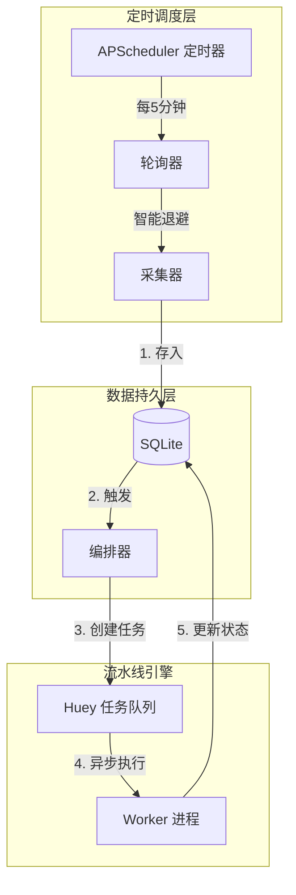

# 任务调度与流水线详细设计

本文档详细描述系统的核心引擎部分：如何通过定时任务发现数据，以及如何通过流水线处理数据。

## 1. 总体架构

系统采用 **生产者-消费者** 模型，将"数据采集"与"数据处理"完全解耦。



## 2. 数据采集 (Collection)

采集层的目标是：**发现新内容**。它不负责下载视频、转录或分析，只负责获取元数据（标题、链接、发布时间）并存入数据库。

### 2.1 调度策略 (Smart Polling)

使用 `APScheduler` (AsyncIOScheduler) 作为调度核心。

*   **全局心跳**: 单个 Job `check_and_collect_sources` 每 5 分钟运行一次。
*   **智能退避 (Exponential Backoff)**:
    *   每个 `SourceConfig` 维护 `last_collected_at` 和 `consecutive_failures`。
    *   基础间隔: `schedule_interval` (默认 1 小时)。
    *   失败退避: 每次失败间隔翻倍，最大 2 小时。`interval = min(base * (2^failures), 7200)`
    *   成功重置: 一旦采集成功，重置失败计数。

### 2.2 采集流程

1.  **加载**: 查找所有 `is_active=True` 且 `schedule_enabled=True` 的源。
2.  **过滤**: 排除尚未这就绪（当前时间 < 上次时间 + 间隔）的源。
3.  **执行**: 调用对应的 Collector (如 `RSSCollector`, `BilibiliCollector`)。
4.  **去重**:
    *   使用 `source_id` + `external_id` (外部唯一ID) 作为唯一约束。
    *   数据库层面 `UniqueConstraint` 防止重复插入。
    *   Collector 返回 `items_found` (总数) 和 `items_new` (新增数)。
5.  **记录**: 写入 `CollectionRecord` 表，记录本次采集状态和日志。

## 3. 流水线编排 (Orchestration)

流水线层的目标是：**处理已存在的内容**。它是事件驱动的。

### 3.1 触发机制

目前支持两种触发方式：
1.  **自动触发 (Scheduled)**: 采集器发现新 ContentItem 后，立即调用 `PipelineOrchestrator.trigger_for_content()`。
2.  **手动触发 (Manual)**: 用户在 UI 上点击"重新分析"或"执行流水线"。

### 3.2 编排流程

1.  **模版加载**: 根据 Source 绑定的 `pipeline_template_id` 加载模版定义。
2.  **实例创建**:
    *   创建 `PipelineExecution` (状态: PENDING)。
    *   根据模版步骤，创建有序的 `PipelineStep` 记录 (状态: PENDING)。
3.  **任务投递**:
    *   `Orchestrator` 将第一个步骤封装为 Huey 任务 (`execute_pipeline_step`)。
    *   提交到 `huey.db` 队列。

### 3.3 执行引擎 (Executor)

`PipelineExecutor` 是无状态的，它负责推进步骤。

**上下文 (Context) 传递**:
每个步骤接收一个 `context` 字典，并在执行后返回更新的 `context`。
```python
ctx = {
    "content_item": {...},       # 原始数据
    "previous_steps": {          # 上游输出
        "step_1_enrich": {...},
        "step_2_transcribe": {...}
    },
    "runtime_config": {...}      # 运行时参数
}
```

**状态流转**:
1.  **Pre-run**: 标记步骤为 RUNNING，更新开始时间。
2.  **Execution**: 调用 `STEP_HANDLERS` 中注册的函数。
3.  **Post-run**:
    *   **成功**: 标记 COMPLETED，保存结果到 `output_data`。检查是否有下一步？
        *   有: 投递下一步任务。
        *   无: 标记整个 Pipeline 为 COMPLETED，ContentItem 标记为 ANALYZED。
    *   **失败**:
        *   **关键步骤**: 标记 FAILED，中断流水线。
        *   **非关键步骤**: 标记 SKIPPED，继续执行下一步（如通知失败不影响主流程）。

## 4. 关键数据模型设计

### 4.1 SourceConfig (数据源)
*   `source_type`: 采用两段式命名 (e.g., `rss.hub`, `web.scraper`)。
*   `config_json`: 存储特定于 Collector 的配置 (如选择器、Cookie)。

### 4.2 PipelineTemplate (模版)
*   `steps`: JSON 数组，定义执行顺序。
    ```json
    [
      {"step_type": "download_video", "is_critical": true},
      {"step_type": "transcribe_content", "is_critical": true},
      {"step_type": "analyze_content", "is_critical": true},
      {"step_type": "publish_content", "is_critical": false}
    ]
    ```

### 4.3 PipelineExecution (执行)
*   `status`: pending / running / completed / failed
*   `current_step_index`: 指针，指向当前正在执行或待执行的步骤。

## 5. 异常处理与恢复

*   **Collector 异常**: 捕获所有异常，记录到 `CollectionRecord.error_message`，触发源的退避机制。不会因为一个源挂掉影响其他源。
*   **Worker 崩溃**: Huey 使用 SQLite 作为持久化队列。如果 Worker 进程崩溃，重启后未完成的任务会重新进入队列（需配置 Huey 的 `acks_late=True` 或重试机制）。
*   **步骤超时**: 单个步骤设置超时时间（如视频下载 30分钟），超时后抛出异常，标记步骤失败。
